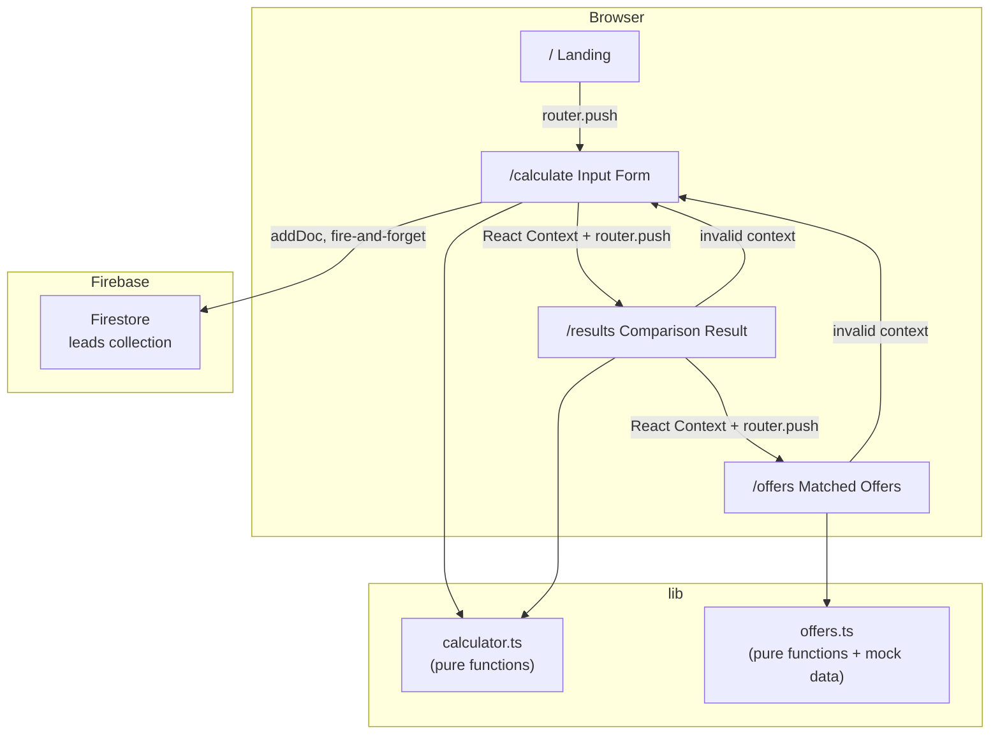

# Design Document: SunScore

## Overview

SunScore is a 4-screen Next.js web application that helps Nigerian households and small businesses see — at a glance — that their existing diesel/generator expenditure already covers the cost of an equivalent solar PAYGo plan. The value proposition is immediate: enter what you already spend, receive a personalised savings comparison and ownership timeline, and see matched offers from real solar PAYGo providers.

The application is intentionally lightweight. There is no authentication, no database reads, and no back-end API. All computation is client-side and deterministic. Firebase Firestore is used solely as a write-only lead capture store; a failed write never blocks the user journey. State is shared between screens via React context; the URL never carries calculation data.

### Key Design Decisions

| Decision | Rationale |
|---|---|
| Pure-function Calculator (`lib/calculator.ts`) | Enables fast, isolated unit and property-based tests without a DOM or React dependency |
| Pure-function OfferMatcher (`lib/offers.ts`) | Same isolation benefit; mock offers are hardcoded so no network call is needed |
| React Context for cross-screen state | Avoids leaking user data into the URL and keeps the routing model clean |
| Non-blocking Firestore write | UX must not degrade if Firebase is misconfigured or slow |
| `"use client"` only on components that need it | Keeps as much of the tree server-rendered as possible for faster initial paint |

---

## Architecture

The application follows the Next.js App Router convention with a clear separation between the UI layer (React components / pages), the business logic layer (pure TS modules in `lib/`), and the infrastructure layer (Firebase client).



### Directory Layout

```
app/
  layout.tsx              # Root layout — wraps children in SunScoreProvider
  page.tsx                # Landing screen (/)
  calculate/
    page.tsx              # Input Form screen (/calculate)
  results/
    page.tsx              # Comparison Result screen (/results)
  offers/
    page.tsx              # Matched Offers screen (/offers)

components/
  SunScoreProvider.tsx    # React context provider (client component)
  InputForm.tsx           # Form with validation (client component)
  ComparisonCard.tsx      # Side-by-side comparison display
  OfferCard.tsx           # Single matched offer card

lib/
  calculator.ts           # Tier classification, savings computation, pre-qual
  offers.ts               # Mock offers array + matchOffers function
  firebase.ts             # Firebase initialisation + env var validation

.env.local.example        # Firebase config placeholder
README.md                 # Setup instructions
```

---

## Components and Interfaces

### `lib/calculator.ts`

Exported types and functions. Zero React/Next.js/browser imports.

```typescript
export type SpendTier =
  | "starter"
  | "standard"
  | "power"
  | "business"
  | "below_threshold";

export interface CalculatorInput {
  dieselSpend: number;
  runHours: number;
  householdSize: number;
  consistencyMonths: number;
  dieselPricePerLitre: number;
}

export interface CalculatorOutput {
  spendTier: SpendTier;
  estimatedMonthlyPayment: number | null;
  ownershipMonthsMin: number | null;
  ownershipMonthsMax: number | null;
  monthlySavings: number | null;
  threeYearSavings: number | null;
  isPreQualified: boolean;
}

export function classifyTier(dieselSpend: number): SpendTier;
export function calculate(input: CalculatorInput): CalculatorOutput;
export function isPreQualified(dieselSpend: number, consistencyMonths: number): boolean;
```

**Tier lookup table (constant — not computed at runtime):**

| Tier | Spend range (₦) | Monthly payment (₦) | Ownership min | Ownership max | Midpoint |
|---|---|---|---|---|---|
| starter | 20,000 – 39,999 | 20,000 | 18 | 24 | 21 |
| standard | 40,000 – 79,999 | 35,000 | 24 | 30 | 27 |
| power | 80,000 – 149,999 | 62,500 | 30 | 36 | 33 |
| business | ≥ 150,000 | 115,000 | 36 | 36 | 36 |
| below_threshold | < 20,000 | null | null | null | — |

**3-Year Savings formula:**

```
threeYearSavings = (dieselSpend × 36) − (estimatedMonthlyPayment × ownershipMonthsMidpoint)
```

Post-ownership months (36 − midpoint) cost ₦0, so diesel savings accumulate for those months.

---

### `lib/offers.ts`

```typescript
export interface Offer {
  provider: "Lumos" | "Arnergy" | "d.light";
  tier: SpendTier;
  monthlyPayment: number;   // > 0
  ownershipMonths: number;  // 1–120 inclusive
  regions: string[];        // non-empty
}

export const mockOffers: Offer[];  // hardcoded, ≥ 2 per provider

export function matchOffers(tier: SpendTier): Offer[];
// Returns offers filtered by exact tier match,
// sorted ascending by monthlyPayment, then ownershipMonths.
```

**Mock offers data (minimum required coverage):**

| Provider | Tier | Monthly (₦) | Ownership (mo) | Regions |
|---|---|---|---|---|
| Lumos | starter | 18,000 | 20 | Lagos, Abuja |
| Lumos | standard | 33,000 | 26 | Lagos, Abuja, Port Harcourt |
| Arnergy | standard | 34,500 | 28 | Lagos, Ibadan |
| Arnergy | power | 60,000 | 32 | Lagos, Abuja |
| d.light | starter | 19,500 | 22 | Nationwide |
| d.light | power | 61,000 | 34 | Lagos, Kano |
| Lumos | business | 110,000 | 36 | Lagos, Abuja |
| Arnergy | business | 112,000 | 36 | Lagos |
| d.light | business | 108,000 | 36 | Nationwide |

---

### `lib/firebase.ts`

```typescript
// Validates env vars, initialises Firebase app, exports Firestore db instance.
// Throws on missing NEXT_PUBLIC_FIREBASE_* variables.
export const db: Firestore;

export async function saveLead(lead: LeadDocument): Promise<void>;
// Calls addDoc on "leads" collection.
// Catches and console.errors any rejection; never rethrows.
```

```typescript
interface LeadDocument {
  dieselSpend: number;
  runHours: number;
  householdSize: number;
  consistencyMonths: number;
  dieselPricePerLitre: number;
  spendTier: string;
  createdAt: FieldValue; // serverTimestamp()
}
```

---

### `components/SunScoreProvider.tsx`

Client component. Wraps the root layout.

```typescript
interface SunScoreContextValue {
  calculatorOutput: CalculatorOutput | null;
  setCalculatorOutput: (output: CalculatorOutput) => void;
}
```

Child routes (`/results`, `/offers`) read `calculatorOutput` from this context. If `calculatorOutput` is `null` or has an invalid `spendTier`, those routes redirect to `/calculate`.

---

### Form Validation Schema

The Input Form validates all fields before allowing submission. Validation runs on submit and on blur.

| Field | Type | Min | Max | Integer required |
|---|---|---|---|---|
| dieselSpend | number | 1 | 10,000,000 | No |
| runHours | number | 0.5 | 24 | No |
| householdSize | number | 1 | 100 | Yes |
| consistencyMonths | number | 1 | 120 | Yes |
| dieselPricePerLitre | number | 100 | 10,000 | No |

Validation errors are displayed inline below each field with the field name and valid range in the message.

---

## Data Models

### Firestore `leads` Collection

Each document is auto-ID'd by `addDoc`.

```
leads/{autoId}
  dieselSpend:          number
  runHours:             number
  householdSize:        number
  consistencyMonths:    number
  dieselPricePerLitre:  number
  spendTier:            string   ("starter" | "standard" | "power" | "business" | "below_threshold")
  createdAt:            Timestamp  (Firestore serverTimestamp())
```

No read operations are performed from the client. The collection is write-only from the app.

### React Context State

```typescript
{
  calculatorOutput: CalculatorOutput | null
}
```

The context is hydrated on form submission and persists for the lifetime of the browser session (in-memory, no localStorage).

---

## Correctness Properties

*A property is a characteristic or behavior that should hold true across all valid executions of a system — essentially, a formal statement about what the system should do. Properties serve as the bridge between human-readable specifications and machine-verifiable correctness guarantees.*

The Calculator and OfferMatcher modules are pure functions with rich input domains, making them excellent candidates for property-based testing. UI-only requirements (display, routing, styling) are tested with example-based tests instead.

The property-based testing library is **[fast-check](https://fast-check.dev/)**, used with **Vitest** as the test runner.

---

### Property 1: Tier classification is total and exhaustive

*For any* finite number `dieselSpend`, `classifyTier` SHALL return exactly one of the five defined `SpendTier` values and SHALL never return `undefined`, throw, or return an unlisted string.

**Validates: Requirements 3.1, 3.2, 3.3, 3.4, 3.5**

---

### Property 2: Tier boundaries are mutually exclusive and cover all non-negative spend

*For any* non-negative `dieselSpend`, the tier returned by `classifyTier` SHALL be:
- `"below_threshold"` if and only if `dieselSpend < 20,000` (after rounding)
- `"starter"` if and only if `20,000 ≤ round(dieselSpend) ≤ 39,999`
- `"standard"` if and only if `40,000 ≤ round(dieselSpend) ≤ 79,999`
- `"power"` if and only if `80,000 ≤ round(dieselSpend) ≤ 149,999`
- `"business"` if and only if `round(dieselSpend) ≥ 150,000`

No two conditions SHALL be simultaneously true for any input.

**Validates: Requirements 3.1, 3.2, 3.3, 3.4, 3.5, 3.7**

---

### Property 3: Below-threshold inputs produce all-null solar estimates

*For any* `CalculatorInput` where `dieselSpend < 20,000` (rounded), `calculate` SHALL return an output where `estimatedMonthlyPayment`, `ownershipMonthsMin`, `ownershipMonthsMax`, `monthlySavings`, and `threeYearSavings` are ALL `null`.

**Validates: Requirements 3.6, 4.7**

---

### Property 4: Tier payment and ownership values are fixed constants per tier

*For any* `dieselSpend` producing a valid (non-below-threshold) tier, the `estimatedMonthlyPayment`, `ownershipMonthsMin`, and `ownershipMonthsMax` values returned by `calculate` SHALL exactly match the tier lookup table constants (Starter: ₦20,000 / 18 / 24; Standard: ₦35,000 / 24 / 30; Power: ₦62,500 / 30 / 36; Business: ₦115,000 / 36 / 36). These values SHALL NOT vary within a tier regardless of the specific `dieselSpend` value.

**Validates: Requirements 4.1, 4.2, 4.3, 4.4**

---

### Property 5: Monthly savings arithmetic invariant

*For any* `CalculatorInput` where `dieselSpend` produces a valid tier, `monthlySavings` SHALL equal `dieselSpend − estimatedMonthlyPayment` exactly (floating point arithmetic, no rounding applied post-subtraction).

**Validates: Requirements 4.5**

---

### Property 6: 3-Year savings formula invariant

*For any* `CalculatorInput` where `dieselSpend` produces a valid tier, `threeYearSavings` SHALL equal `(dieselSpend × 36) − (estimatedMonthlyPayment × ownershipMonthsMidpoint)`, where `ownershipMonthsMidpoint = (ownershipMonthsMin + ownershipMonthsMax) / 2`.

**Validates: Requirements 4.6**

---

### Property 7: Payment is strictly less than tier upper bound

*For any* `dieselSpend` that classifies to a valid tier, `estimatedMonthlyPayment` SHALL be strictly less than the upper bound of the Diesel Spend range for that tier (Starter < ₦40,000; Standard < ₦80,000; Power < ₦150,000; Business: no upper bound applicable).

**Validates: Requirements 4.8**

---

### Property 8: Pre-qualification requires both conditions simultaneously

*For any* numeric `dieselSpend` and numeric `consistencyMonths`, `isPreQualified` SHALL return `true` if and only if BOTH `dieselSpend ≥ 20,000` AND `consistencyMonths ≥ 3` are true. If either condition fails, the result SHALL be `false`.

**Validates: Requirements 6.1, 6.2, 6.3**

---

### Property 9: Input validation accepts exactly the valid range

*For any* numeric value in the valid range of each input field (as defined in the validation schema table), the validation function SHALL return no error for that field. *For any* numeric value strictly outside the valid range, the validation function SHALL return an error identifying the field and valid range.

**Validates: Requirements 2.2, 2.3, 2.4, 2.5, 2.6**

---

### Property 10: Offer filtering preserves only exact tier matches

*For any* `SpendTier` value and any array of `Offer` objects (with arbitrary tiers), `matchOffers` SHALL return a list containing only offers whose `tier` field exactly matches (case-sensitive string equality) the requested tier. No offer with a different tier SHALL appear in the result.

**Validates: Requirements 7.4**

---

### Property 11: Offer sorting invariant

*For any* filtered offer list returned by `matchOffers`, every adjacent pair of offers `(offers[i], offers[i+1])` SHALL satisfy: `offers[i].monthlyPayment ≤ offers[i+1].monthlyPayment`. When `offers[i].monthlyPayment === offers[i+1].monthlyPayment`, then `offers[i].ownershipMonths ≤ offers[i+1].ownershipMonths`.

**Validates: Requirements 7.5**

---

## Error Handling

### Firebase Initialisation Errors

At module load time, `lib/firebase.ts` reads all six `NEXT_PUBLIC_FIREBASE_*` environment variables. If any are missing or empty, it collects the names of the missing variables and throws a single descriptive error:

```
Missing Firebase config: NEXT_PUBLIC_FIREBASE_API_KEY, NEXT_PUBLIC_FIREBASE_PROJECT_ID
```

This error surfaces during `npm run build` (Next.js evaluates module imports at build time for server components), giving the developer immediate feedback.

### Firestore Write Failures

`saveLead` wraps `addDoc` in a `try/catch`. On rejection, it calls `console.error(error)` and returns normally. The form submit handler calls `saveLead` with `await` but does not itself catch errors — `saveLead` is guaranteed never to throw. The router navigation to `/results` follows immediately regardless of the Firestore write result.

```typescript
// In the form submit handler:
saveLead(leadDoc);  // intentionally not awaited — fire and forget
router.push("/results");
```

> Note: `saveLead` is called without `await` to ensure navigation is never delayed by a slow network. The function internally awaits `addDoc` but resolves silently on failure.

### Invalid Context / Direct URL Access

Routes `/results` and `/offers` guard against direct access by checking `calculatorOutput` from context at the top of the component:

```typescript
// In /results/page.tsx and /offers/page.tsx
const { calculatorOutput } = useSunScore();
if (!calculatorOutput || calculatorOutput.spendTier === undefined) {
  redirect("/calculate");
}
```

This uses Next.js's `redirect()` helper (which throws internally, so it must be called outside any try/catch block for the route).

### Form Validation Errors

Validation errors are accumulated per-field and displayed inline. The form does not submit (no Calculator call, no Firestore write, no navigation) while any validation error is present. The Submit button is not disabled — the validation runs on submit, providing clear feedback rather than silent blocking.

### Below-Threshold Spend

When `spendTier === "below_threshold"`, the Results screen renders a distinct fallback UI: no comparison data is shown, and a message explains the minimum threshold with a link back to `/calculate`. This is not an error — it is a valid application state.

---

## Testing Strategy

### Dual Testing Approach

Both unit/example tests and property-based tests are used together for comprehensive coverage.

- **Unit/example tests**: specific scenarios, UI rendering, integration points (Firebase mock), routing guards, error handling
- **Property-based tests** (`fast-check`): universal correctness of `lib/calculator.ts` and `lib/offers.ts`

### Test Runner

**Vitest** is used as the test runner. It is compatible with Next.js App Router, runs in Node.js (matching the requirement for `lib/calculator.ts`), and integrates natively with `fast-check`.

### Unit Test Coverage

| Area | Test type | What is verified |
|---|---|---|
| Landing screen renders | SMOKE | Component mounts, headline and CTA present |
| CTA navigation | EXAMPLE | Button click triggers router.push to `/calculate` |
| Input Form renders fields | SMOKE | All 5 fields present, diesel price defaults to ₦1,600 |
| Form submit with valid data | EXAMPLE | Navigator called, saveLead called |
| Form submit with invalid data | EXAMPLE | Error messages shown, no navigation |
| Firestore write failure | EXAMPLE | console.error called, navigation still occurs |
| Results screen — valid context | EXAMPLE | Monthly savings, ownership timeline, 3-year savings shown |
| Results screen — below_threshold | EXAMPLE | Fallback message shown, no comparison data |
| Results screen — no context | EXAMPLE | Redirects to `/calculate` |
| Offers screen — matched offers | EXAMPLE | Offer cards rendered with correct data |
| Offers screen — pre-qualified badge | EXAMPLE | Badge appears on first offer when isPreQualified=true |
| Offers screen — no matches | EXAMPLE | Fallback message and link shown |
| Offers screen — no context | EXAMPLE | Redirects to `/calculate` |
| Firebase missing env var | EXAMPLE | Throws error naming missing variables |
| Firebase addDoc rejection | EXAMPLE | Caught, not rethrown |

### Property-Based Test Configuration

Each property-based test is configured with a minimum of **100 iterations** (fast-check default is 100; increase to 500 for boundary-heavy tests).

Tag comment format for each property test:
```typescript
// Feature: sunscore, Property N: <property text>
```

| Property | Implementation notes |
|---|---|
| P1 – Tier totality | `fc.double()` over wide range; assert result is one of 5 valid strings |
| P2 – Tier boundaries | `fc.integer()` + `fc.double()` near boundaries; verify exact tier expected |
| P3 – Below-threshold nulls | `fc.integer({ max: 19999 })` + arbitrary other fields; verify all output fields null |
| P4 – Tier constants | Generator per tier range; verify exact constant values |
| P5 – Monthly savings | `fc.integer({ min: 20000 })` + other valid fields; verify `monthlySavings === dieselSpend - estimatedMonthlyPayment` |
| P6 – 3-Year savings | Same generator as P5; verify full formula |
| P7 – Payment < upper bound | Same generator; verify payment vs tier upper bound |
| P8 – Pre-qualification | `fc.integer()` × `fc.integer()` generators for both inputs; verify biconditional |
| P9 – Validation ranges | `fc.float()` within/outside each field's range; verify accept/reject |
| P10 – Offer filter | `fc.array(fc.record({...}))` + `fc.constantFrom(...tiers)`; verify filter correctness |
| P11 – Offer sort | Same generator as P10; verify adjacent pair invariant |

### Coverage Notes

- `lib/calculator.ts` and `lib/offers.ts` should achieve near-100% statement coverage through property tests alone.
- Firebase integration is tested with Vitest mocks (`vi.mock('firebase/firestore')`), never hitting a real Firestore instance.
- React component tests use `@testing-library/react` with a mock `SunScoreProvider`.
- No end-to-end (Playwright/Cypress) tests are specified in this scope; the pure-function coverage from property tests provides the primary correctness guarantee.

## `lib/offers.ts` Design

```typescript
// lib/offers.ts
import type { Offer, SpendTier } from "@/types";

// ─── MOCK_OFFERS ──────────────────────────────────────────────────────────────
// At least 2 entries per provider across the defined spend tiers.

export const MOCK_OFFERS: Offer[] = [
  // Lumos
  {
    provider: "Lumos",
    tier: "starter",
    monthlyPayment: 18_500,
    ownershipMonths: 24,
    regions: ["Lagos", "Ogun", "Oyo"],
  },
  {
    provider: "Lumos",
    tier: "standard",
    monthlyPayment: 33_000,
    ownershipMonths: 30,
    regions: ["Lagos", "Abuja", "Rivers"],
  },
  {
    provider: "Lumos",
    tier: "power",
    monthlyPayment: 60_000,
    ownershipMonths: 36,
    regions: ["Lagos", "Kano", "Abuja"],
  },

  // Arnergy
  {
    provider: "Arnergy",
    tier: "starter",
    monthlyPayment: 19_000,
    ownershipMonths: 22,
    regions: ["Lagos", "Delta", "Anambra"],
  },
  {
    provider: "Arnergy",
    tier: "standard",
    monthlyPayment: 34_500,
    ownershipMonths: 28,
    regions: ["Lagos", "Abuja", "Enugu"],
  },
  {
    provider: "Arnergy",
    tier: "business",
    monthlyPayment: 110_000,
    ownershipMonths: 36,
    regions: ["Lagos", "Abuja", "Port Harcourt"],
  },

  // d.light
  {
    provider: "d.light",
    tier: "starter",
    monthlyPayment: 17_000,
    ownershipMonths: 24,
    regions: ["Kano", "Kaduna", "Sokoto", "Katsina"],
  },
  {
    provider: "d.light",
    tier: "standard",
    monthlyPayment: 32_000,
    ownershipMonths: 30,
    regions: ["Kano", "Lagos", "Abuja"],
  },
  {
    provider: "d.light",
    tier: "power",
    monthlyPayment: 58_000,
    ownershipMonths: 34,
    regions: ["Lagos", "Kano", "Ibadan"],
  },
];

// ─── matchOffers() ────────────────────────────────────────────────────────────

/**
 * Filters MOCK_OFFERS to those matching the user's SpendTier, then sorts
 * ascending by monthlyPayment; ties broken by ownershipMonths ascending.
 *
 * Preconditions:
 *   - tier is a valid SpendTier string
 *   - preQualified is a boolean
 *
 * Postconditions:
 *   - Returns a new array (does not mutate MOCK_OFFERS)
 *   - All returned offers have offer.tier === tier (exact, case-sensitive)
 *   - Array is sorted: offers[i].monthlyPayment <= offers[i+1].monthlyPayment
 *     and on ties: offers[i].ownershipMonths <= offers[i+1].ownershipMonths
 *   - If no offers match, returns []
 *
 * Note: preQualified is passed through so callers know whether to badge
 * the first offer — it does NOT affect filtering or sorting.
 *
 * @param tier         The user's classified SpendTier
 * @param preQualified Whether the user is pre-qualified
 * @returns Sorted, filtered array of Offer objects
 */
export function matchOffers(
  tier: SpendTier,
  preQualified: boolean
): { offers: Offer[]; preQualified: boolean } {
  const filtered = MOCK_OFFERS.filter((o) => o.tier === tier);
  const sorted = [...filtered].sort((a, b) => {
    if (a.monthlyPayment !== b.monthlyPayment) {
      return a.monthlyPayment - b.monthlyPayment;
    }
    return a.ownershipMonths - b.ownershipMonths;
  });
  return { offers: sorted, preQualified };
}
```

---

## React Context Design

### `context/SunScoreContext.tsx`

```typescript
// context/SunScoreContext.tsx
"use client";

import {
  createContext,
  useContext,
  useState,
  type ReactNode,
} from "react";
import type { CalculatorInput, CalculatorOutput } from "@/types";

interface SunScoreContextValue {
  /** Raw form inputs (null until form is submitted) */
  inputs: CalculatorInput | null;
  /** Calculator output (null until form is submitted) */
  output: CalculatorOutput | null;
  /** Stores both inputs and output together after form submission */
  setResult: (inputs: CalculatorInput, output: CalculatorOutput) => void;
  /** Resets context (e.g., "Start Over" button) */
  reset: () => void;
}

export const SunScoreContext = createContext<SunScoreContextValue | null>(null);

export function SunScoreProvider({ children }: { children: ReactNode }) {
  const [inputs, setInputs] = useState<CalculatorInput | null>(null);
  const [output, setOutput] = useState<CalculatorOutput | null>(null);

  function setResult(i: CalculatorInput, o: CalculatorOutput) {
    setInputs(i);
    setOutput(o);
  }

  function reset() {
    setInputs(null);
    setOutput(null);
  }

  return (
    <SunScoreContext.Provider value={{ inputs, output, setResult, reset }}>
      {children}
    </SunScoreContext.Provider>
  );
}

/** Throws if used outside SunScoreProvider — intentional. */
export function useSunScore(): SunScoreContextValue {
  const ctx = useContext(SunScoreContext);
  if (!ctx) throw new Error("useSunScore must be used within SunScoreProvider");
  return ctx;
}
```

### Provider Placement

`SunScoreProvider` wraps the entire app in `app/layout.tsx`:

```typescript
// app/layout.tsx
import { SunScoreProvider } from "@/context/SunScoreContext";

export default function RootLayout({ children }: { children: React.ReactNode }) {
  return (
    <html lang="en">
      <body>
        <SunScoreProvider>{children}</SunScoreProvider>
      </body>
    </html>
  );
}
```

### Data Flow Between Screens

```
/ (Landing)
  └── "Calculate My Savings" → navigate to /calculate

/calculate (Input Form)
  ├── User fills 5 fields
  ├── On submit: calculateSavings(input) → CalculatorOutput
  ├── context.setResult(input, output)          ← WRITE to context
  ├── saveLead(input, output.spendTier)          ← non-blocking Firestore write
  └── router.push("/results")

/results (Comparison Result)
  ├── context.output read                        ← READ from context
  ├── Guard: if output is null → redirect /calculate
  ├── Renders ComparisonCard, SavingsSummary, OwnershipTimeline
  └── "See Matched Offers" → navigate to /offers

/offers (Matched Offers)
  ├── context.output read                        ← READ from context
  ├── Guard: if output is null → redirect /calculate
  ├── matchOffers(output.spendTier, output.preQualified)
  └── Renders OfferList with optional Pre-Qualified badge on index 0
```

---

## Routing and Redirect Guard Pattern

Both `/results` and `/offers` are client components that guard against direct URL access. The guard runs before any render output via `useEffect` with an immediate redirect.

```typescript
// Pattern used in app/results/page.tsx and app/offers/page.tsx
"use client";

import { useEffect } from "react";
import { useRouter } from "next/navigation";
import { useSunScore } from "@/context/SunScoreContext";

export default function ResultsPage() {
  const router = useRouter();
  const { output } = useSunScore();

  useEffect(() => {
    // Guard: redirect if context is missing or incomplete
    if (
      !output ||
      !output.spendTier ||
      output.estimatedMonthlyPayment === undefined
    ) {
      router.replace("/calculate");
    }
  }, [output, router]);

  // Prevent flash of content while redirect is in-flight
  if (!output) return null;

  // ... render page content
}
```

**Why `router.replace` not `router.push`**: Replace keeps the browser history clean — the user won't hit "back" and bounce between the guarded route and `/calculate` in a loop.

---

## Firebase Integration Design

### `lib/firebase.ts`

```typescript
// lib/firebase.ts
import { initializeApp, getApps } from "firebase/app";
import {
  getFirestore,
  collection,
  addDoc,
  serverTimestamp,
} from "firebase/firestore";
import type { CalculatorInput } from "@/types";
import type { SpendTier } from "@/types";

// ─── Environment variable validation ─────────────────────────────────────────

const REQUIRED_ENV_VARS = [
  "NEXT_PUBLIC_FIREBASE_API_KEY",
  "NEXT_PUBLIC_FIREBASE_AUTH_DOMAIN",
  "NEXT_PUBLIC_FIREBASE_PROJECT_ID",
  "NEXT_PUBLIC_FIREBASE_STORAGE_BUCKET",
  "NEXT_PUBLIC_FIREBASE_MESSAGING_SENDER_ID",
  "NEXT_PUBLIC_FIREBASE_APP_ID",
] as const;

function getFirebaseConfig() {
  const missing = REQUIRED_ENV_VARS.filter(
    (key) => !process.env[key] || process.env[key] === ""
  );
  if (missing.length > 0) {
    throw new Error(`Missing Firebase config: ${missing.join(", ")}`);
  }
  return {
    apiKey: process.env.NEXT_PUBLIC_FIREBASE_API_KEY!,
    authDomain: process.env.NEXT_PUBLIC_FIREBASE_AUTH_DOMAIN!,
    projectId: process.env.NEXT_PUBLIC_FIREBASE_PROJECT_ID!,
    storageBucket: process.env.NEXT_PUBLIC_FIREBASE_STORAGE_BUCKET!,
    messagingSenderId: process.env.NEXT_PUBLIC_FIREBASE_MESSAGING_SENDER_ID!,
    appId: process.env.NEXT_PUBLIC_FIREBASE_APP_ID!,
  };
}

// ─── Singleton initialisation (safe for Next.js HMR) ─────────────────────────

const app =
  getApps().length === 0
    ? initializeApp(getFirebaseConfig())
    : getApps()[0];

export const db = getFirestore(app);

// ─── saveLead() ───────────────────────────────────────────────────────────────

/**
 * Writes a lead document to Firestore.
 * Non-blocking: caller does not need to await this.
 * Errors are caught and logged; they never propagate to the caller.
 *
 * Preconditions:
 *   - input fields are validated (called only after successful form submit)
 *   - spendTier is a valid SpendTier string
 *
 * Postconditions:
 *   - On success: document written to leads collection with serverTimestamp
 *   - On failure: error logged to console.error; promise resolves (not rejected)
 */
export async function saveLead(
  input: CalculatorInput,
  spendTier: SpendTier
): Promise<void> {
  try {
    await addDoc(collection(db, "leads"), {
      dieselSpend: input.dieselSpend,
      runHours: input.runHours,
      householdSize: input.householdSize,
      consistencyMonths: input.consistencyMonths,
      dieselPricePerLitre: input.dieselPricePerLitre,
      spendTier,
      createdAt: serverTimestamp(),
    });
  } catch (error) {
    console.error("[SunScore] Firestore lead write failed:", error);
    // Intentionally swallowed — write is non-blocking
  }
}
```

### Environment Variables File

```bash
# .env.local.example

# Firebase project configuration — copy to .env.local and fill in real values
# Found in Firebase Console → Project Settings → Your apps → SDK setup

NEXT_PUBLIC_FIREBASE_API_KEY=your-api-key-here          # Web API key
NEXT_PUBLIC_FIREBASE_AUTH_DOMAIN=your-project.firebaseapp.com
NEXT_PUBLIC_FIREBASE_PROJECT_ID=your-project-id         # Firestore project ID
NEXT_PUBLIC_FIREBASE_STORAGE_BUCKET=your-project.appspot.com
NEXT_PUBLIC_FIREBASE_MESSAGING_SENDER_ID=000000000000   # Cloud Messaging sender
NEXT_PUBLIC_FIREBASE_APP_ID=1:000000000000:web:abc123   # App registration ID
```

---

## Screen Component Structure

### Screen 1: Landing (`app/page.tsx`)

```
app/page.tsx (Server Component)
└── <main>
    └── LandingHero
        ├── <h1> "You've been affording solar this whole time — you just didn't know it."
        ├── <p>  Supporting description (1–2 sentences)
        └── <Button> "Calculate My Savings"
                     → href="/calculate"  (Next.js <Link>)
```

**Props**: None (pure presentational, no context needed)

---

### Screen 2: Input Form (`app/calculate/page.tsx`)

```
app/calculate/page.tsx ("use client")
└── <main>
    └── CalculatorForm
        ├── FormField  label="Monthly Diesel Spend (₦)"
        │              name="dieselSpend"
        │              type="number"  min=1  max=10000000
        ├── FormField  label="Daily Run Hours"
        │              name="runHours"
        │              type="number"  min=0.5  max=24  step=0.5
        ├── FormField  label="Household Size (people)"
        │              name="householdSize"
        │              type="number"  min=1  max=100  integerOnly
        ├── FormField  label="Consistency Months"
        │              name="consistencyMonths"
        │              type="number"  min=1  max=120  integerOnly
        ├── FormField  label="Diesel Price per Litre (₦)"
        │              name="dieselPricePerLitre"
        │              type="number"  min=100  max=10000  defaultValue=1600
        └── <Button type="submit"> "Calculate My Savings"
```

**Behaviour on submit**:
1. Validate all fields; on error render inline messages, stay on page
2. `output = calculateSavings(validatedInput)`
3. `context.setResult(validatedInput, output)`
4. `saveLead(validatedInput, output.spendTier)` — fire-and-forget (no `await`)
5. `router.push("/results")`

**`FormField` props**:
```typescript
interface FormFieldProps {
  label: string;
  name: keyof CalculatorInput;
  error?: string;          // validation error message
  defaultValue?: number;
  min: number;
  max: number;
  step?: number;
  integerOnly?: boolean;
}
```

---

### Screen 3: Comparison Result (`app/results/page.tsx`)

```
app/results/page.tsx ("use client")
├── Guard: useEffect → redirect /calculate if output null/invalid
└── <main>
    ├── [if spendTier === "below_threshold"]
    │   └── BelowThresholdMessage
    │       ├── Informational copy
    │       └── <Link href="/calculate"> Back to Calculator
    │
    └── [else]
        ├── ComparisonCard
        │   ├── DieselColumn  value=inputs.dieselSpend
        │   └── SolarColumn   value=output.estimatedMonthlyPayment
        ├── SavingsSummary
        │   ├── Monthly Savings stat  value=output.monthlySavings
        │   └── 3-Year Savings headline  value=output.threeYearSavings
        ├── OwnershipTimeline
        │   └── Range copy or single-month copy
        └── <Button> "See My Matched Offers"
                     → onClick: router.push("/offers")
```

---

### Screen 4: Matched Offers (`app/offers/page.tsx`)

```
app/offers/page.tsx ("use client")
├── Guard: useEffect → redirect /calculate if output null/invalid
└── <main>
    ├── [if matchedOffers.length === 0]
    │   ├── Fallback message: "No matched offers currently available"
    │   └── <Link href="/calculate"> Back to Calculator
    │
    └── [else]
        └── OfferList
            ├── OfferCard (index=0, showBadge=output.preQualified)
            │   ├── Badge "Pre-Qualified ✓"  [conditional]
            │   ├── Provider name
            │   ├── Monthly payment (₦)
            │   ├── Ownership timeline "X months"
            │   └── Regions (comma-separated)
            ├── OfferCard (index=1, showBadge=false)
            └── ... remaining offers
```

**`OfferCard` props**:
```typescript
interface OfferCardProps {
  offer: Offer;
  showBadge: boolean;  // true only for index 0 when preQualified
}
```

---

## Property-Based Testing Strategy

All properties target the two pure-function modules (`lib/calculator.ts` and `lib/offers.ts`), which can be imported in a Node.js test runner without a DOM. The recommended library is **fast-check** (TypeScript-native, works with Vitest/Jest).

### Calculator Properties (`lib/calculator.ts`)

#### `classifyTier()`

| Property | Description | fast-check Arbitraries |
|---|---|---|
| **Total function** | Every finite number produces exactly one SpendTier | `fc.float({ noNaN: true, noDefaultInfinity: true })` |
| **Below threshold** | Any rounded value < 20,000 → `"below_threshold"` | `fc.integer({ max: 19_999 })` |
| **Starter range** | Rounded value in [20,000, 39,999] → `"starter"` | `fc.integer({ min: 20_000, max: 39_999 })` |
| **Standard range** | Rounded value in [40,000, 79,999] → `"standard"` | `fc.integer({ min: 40_000, max: 79_999 })` |
| **Power range** | Rounded value in [80,000, 149,999] → `"power"` | `fc.integer({ min: 80_000, max: 149_999 })` |
| **Business range** | Rounded value ≥ 150,000 → `"business"` | `fc.integer({ min: 150_000, max: 10_000_000 })` |
| **Rounding at boundary** | Values that round to 40,000 → `"standard"` (not `"starter"`) | `fc.float({ min: 39_999.5, max: 39_999.999 })` |
| **Negative input** | Any negative value → `"below_threshold"` | `fc.integer({ max: -1 })` |

#### `checkPreQualification()`

| Property | Description | fast-check Arbitraries |
|---|---|---|
| **True iff both thresholds met** | spend ≥ 20,000 AND months ≥ 3 → `true` | `fc.tuple(fc.integer({min:20_000}), fc.integer({min:3}))` |
| **False if spend below** | spend < 20,000 → `false` regardless of months | `fc.tuple(fc.integer({max:19_999}), fc.integer({min:1}))` |
| **False if months below** | months < 3 → `false` regardless of spend | `fc.tuple(fc.integer({min:20_000}), fc.integer({min:1,max:2}))` |
| **False for non-numeric** | null, undefined, NaN, string → `false` | `fc.oneof(fc.string(), fc.constant(null), fc.constant(undefined))` |
| **False for Infinity** | Infinity or -Infinity → `false` | `fc.constant(Infinity)` and `fc.constant(-Infinity)` |

#### `calculateSavings()`

| Property | Description |
|---|---|
| **Null outputs iff below_threshold** | `spendTier === "below_threshold"` ↔ all numeric outputs are `null` |
| **Savings identity** | `monthlySavings + estimatedMonthlyPayment === dieselSpend` for valid tiers |
| **3-year formula** | `threeYearSavings === dieselSpend * 36 - payment * midpoint` |
| **Payment always < tier upper bound** | `estimatedMonthlyPayment < tierUpperBound` for all valid tiers |
| **preQualified consistency** | `calculateSavings(input).preQualified === checkPreQualification(dieselSpend, consistencyMonths)` |
| **Deterministic** | Same input always produces identical output (referential transparency) |

### OfferMatcher Properties (`lib/offers.ts`)

| Property | Description |
|---|---|
| **Tier filter correctness** | Every returned offer has `offer.tier === tier` exactly |
| **Sort correctness** | For all adjacent pairs `i`: `offers[i].monthlyPayment ≤ offers[i+1].monthlyPayment` |
| **Tie-break correctness** | For adjacent pairs with equal payment: `offers[i].ownershipMonths ≤ offers[i+1].ownershipMonths` |
| **Non-mutation** | `MOCK_OFFERS` array reference and elements unchanged after any `matchOffers()` call |
| **Empty result for unknown tier** | Passing a tier with no matching offers returns `[]` |
| **Idempotent** | Calling `matchOffers()` twice with same args returns identically ordered results |
| **preQualified pass-through** | `result.preQualified === preQualified` argument passed in |

### Example Test Skeleton (Vitest + fast-check)

```typescript
// lib/__tests__/calculator.test.ts
import { describe, it, expect } from "vitest";
import * as fc from "fast-check";
import { classifyTier, checkPreQualification, calculateSavings } from "@/lib/calculator";

describe("classifyTier — properties", () => {
  it("classifies every finite number without throwing", () => {
    fc.assert(
      fc.property(fc.float({ noNaN: true, noDefaultInfinity: true }), (spend) => {
        const validTiers = ["below_threshold","starter","standard","power","business"];
        expect(validTiers).toContain(classifyTier(spend));
      })
    );
  });

  it("any rounded value < 20,000 is below_threshold", () => {
    fc.assert(
      fc.property(fc.integer({ max: 19_999 }), (spend) => {
        expect(classifyTier(spend)).toBe("below_threshold");
      })
    );
  });
});

describe("calculateSavings — savings identity", () => {
  it("monthlySavings + payment === dieselSpend for valid tiers", () => {
    fc.assert(
      fc.property(fc.integer({ min: 20_000, max: 10_000_000 }), (dieselSpend) => {
        const output = calculateSavings({
          dieselSpend,
          runHours: 8,
          householdSize: 4,
          consistencyMonths: 6,
          dieselPricePerLitre: 1600,
        });
        if (output.monthlySavings !== null && output.estimatedMonthlyPayment !== null) {
          expect(output.monthlySavings + output.estimatedMonthlyPayment).toBe(dieselSpend);
        }
      })
    );
  });
});
```

---

## Tailwind CSS Design Tokens and Color Palette

### Brand Rationale

SunScore speaks to cost-conscious Nigerian households. The palette uses warm amber/gold (solar energy, optimism, wealth), deep forest green (sustainability, savings), and clean off-white/charcoal neutrals. All pairs meet WCAG AA contrast requirements.

### Color Tokens (`tailwind.config.ts`)

```typescript
// tailwind.config.ts
import type { Config } from "tailwindcss";

const config: Config = {
  content: [
    "./app/**/*.{ts,tsx}",
    "./components/**/*.{ts,tsx}",
  ],
  theme: {
    extend: {
      colors: {
        // Primary — solar amber
        sun: {
          50:  "#fffbeb",
          100: "#fef3c7",
          200: "#fde68a",
          300: "#fcd34d",
          400: "#fbbf24",   // ← primary CTA background
          500: "#f59e0b",   // ← primary CTA hover
          600: "#d97706",
          700: "#b45309",
          800: "#92400e",
          900: "#78350f",
        },
        // Accent — forest green (savings/growth)
        leaf: {
          50:  "#f0fdf4",
          100: "#dcfce7",
          200: "#bbf7d0",
          300: "#86efac",
          400: "#4ade80",
          500: "#22c55e",   // ← savings stat colour
          600: "#16a34a",   // ← badge background
          700: "#15803d",
          800: "#166534",
          900: "#14532d",
        },
        // Neutral — warm charcoal (not cold grey)
        coal: {
          50:  "#fafaf9",
          100: "#f5f5f4",
          200: "#e7e5e4",
          300: "#d6d3d1",
          400: "#a8a29e",
          500: "#78716c",
          600: "#57534e",
          700: "#44403c",
          800: "#292524",   // ← body text
          900: "#1c1917",   // ← headings
        },
        // Semantic
        error:   "#ef4444",   // validation errors
        warning: "#f97316",   // below-threshold message
        info:    "#3b82f6",
      },
      fontFamily: {
        // Fallback to system fonts — performant for low-bandwidth connections
        sans: ["Inter", "ui-sans-serif", "system-ui", "sans-serif"],
        display: ["Sora", "ui-sans-serif", "system-ui", "sans-serif"],
      },
      borderRadius: {
        "2xl": "1rem",
        "3xl": "1.5rem",
      },
      boxShadow: {
        card: "0 4px 24px 0 rgba(0,0,0,0.08)",
        "card-hover": "0 8px 32px 0 rgba(0,0,0,0.14)",
      },
    },
  },
  plugins: [],
};

export default config;
```

### Component Style Guide

| Element | Tailwind Classes |
|---|---|
| CTA Primary Button | `bg-sun-400 hover:bg-sun-500 text-coal-900 font-semibold px-8 py-3 rounded-2xl shadow-card transition` |
| Pre-Qualified Badge | `bg-leaf-600 text-white text-xs font-bold px-3 py-1 rounded-full uppercase tracking-wider` |
| Savings Stat (positive) | `text-leaf-600 font-display text-4xl font-bold` |
| Below-threshold warning | `text-warning bg-orange-50 border border-orange-200 rounded-2xl p-4` |
| Card surface | `bg-white rounded-3xl shadow-card p-6` |
| Heading (H1) | `text-coal-900 font-display text-5xl font-bold leading-tight` |
| Subheading | `text-coal-600 text-lg font-normal` |
| Form input | `border border-coal-300 rounded-xl px-4 py-2.5 text-coal-800 focus:ring-2 focus:ring-sun-400 focus:border-transparent` |
| Validation error | `text-error text-sm mt-1` |

### Page Background

```css
/* globals.css — applied to <body> */
body {
  @apply bg-coal-50 text-coal-800;
}
```

The background uses warm `coal-50` (#fafaf9) rather than pure white, giving screens a premium feel without harsh contrast.

---

## Error Handling Design

| Scenario | Handler | User Experience |
|---|---|---|
| Form validation error | Inline `FormField` error, form does not submit | Error appears below field immediately |
| `spendTier === "below_threshold"` | `BelowThresholdMessage` component | "Your current spend is below the minimum for a PAYGo match. Try reducing other costs first." + back link |
| Firestore `addDoc` failure | `catch` in `saveLead()`, `console.error` | Silent — user navigates to `/results` normally |
| Direct URL access to guarded route | `useEffect` guard + `router.replace("/calculate")` | Immediate redirect, no flash of content |
| No offers match tier | `OfferList` empty-state branch | "No matched offers currently available." + back link |
| Missing Firebase env vars | `throw new Error(...)` in `getFirebaseConfig()` | Build/runtime crash with descriptive message listing missing vars |

---

## Dependencies

| Package | Version (approx.) | Purpose |
|---|---|---|
| `next` | 14.x | App Router, SSR, routing |
| `react` / `react-dom` | 18.x | UI layer |
| `typescript` | 5.x | Type safety |
| `tailwindcss` | 3.x | Utility-first CSS |
| `firebase` | 10.x | Firestore client SDK |
| `fast-check` | 3.x | Property-based testing |
| `vitest` | 1.x | Test runner (or Jest) |
| `@testing-library/react` | 14.x | Component testing (optional) |

No additional state management library (Zustand, Redux) is needed — React context is sufficient for the 4-screen linear flow.
